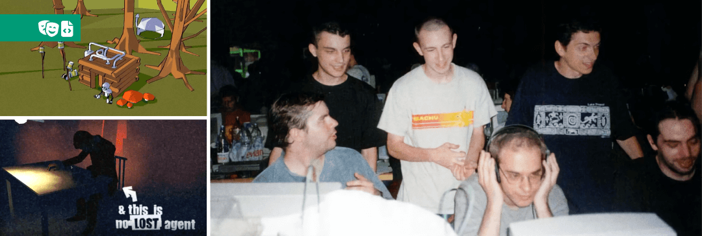

# Astrofra

> I am especially interested by digital interactive tools that support the creative process of an artwork from its design to its diffusion. The unpredictable and random nature of software is like a performance, and I have always enjoyed navigating in this area of uncertainty.
However, the use of the ever-changing digital tools is not the ultimate goal. Exploring their advantages and limitations through deep practice should go with a critical reflection.  
With a background in both computer development and graphic design, I have tried to merge technology and artistic expression throughout my career.

 

## What I do _for a living_

 

### **2018 - Present** HARFANG 3D (Project Lead)

[HARFANG](https://www.harfang3d.com) is an [open source](https://github.com/harfang3d/harfang3d) 3D engine designed for industrial use. My work includes design, functionality, user interface and documentation, as well as helping clients with their projects running on HARFANG.

 
_Harfang Studio interface with demo projects._ 

In my coordination and facilitation work on HARFANG, I have focused on the concept of "digital twin", which I've illustrated by directing and contributing to the creation of a prototype demonstrating remote control of a [robotic device](https://github.com/harfang3d/python-digital-twin).

 
_Digital twins of the robots Reachy (Pollen Robotics) and Poppy Ergo Junior (Projet Poppy, Inria)._ 

One of my tasks consisted in co-developing a workflow for the industrialisation of virtual reality training, connecting 3D content, points of interest and scripting. A linear script describes the training from a practical point of view and links practical actions to each point of interest. I led a team of 3 people: a C++ developer, a 3D graphic designer and a technical artist.

 
_Screenshots and VR views of industrial training._ 

 

### **1999 - 2018** Movida Production (Technical artist)

- Writing specifications, creating prototypes, 3D modeling and integration, scenario implementation on a range of [professional driving simulators](https://develter.com/).
- [Automated 3D packshot](https://www.virtualpackshot.com) POC for retail (based on Renderman) and then co-development of the industrialized version (based on Mental Ray).
- Writing specifications, testing, and deploying a real-time 3D CPU engine applied to 3D packshots.

 
_Screenshot of a 3rd generation driving simulator._ 

 
_3D packshots generated by an automatic pipeline, based on the Renderman-compliant SDK by Art-Render._ 

 

### ***1995*** Microids, Fort Boyard – 'The Challenge'

During the summer of 1995, I worked on the [adaptation of Fort Boyard](https://www.mobygames.com/game/162561/fort-boyard-le-defi/) for PC MS-Dos as a C developer. The Microïds team had just put together a 2D framework in C/ASM in which I worked fully indepently, from the integration of the graphic assets, the implementation of the gameplay and the display, to the occasional bug diagnostics on the framework.

 
_Screenshots of two challenges completed during my mission and the game cover._ 

### ***1994*** Silmarils, Ishar 3 CD-Rom

At Silmarils, during summer 1994, I created the cinematic intro of [Ishar III CD-Rom](https://www.mobygames.com/game/7702/ishar-3-the-seven-gates-of-infinity/) as a 3D computer graphics artist.
My job was to make the entire sequence in 3D animation. The output I produced was incorporated as is. This mission started as an internship and was paid as a freelance.

 
_Screenshots prepared for the game promotion by ["Generation 4" issue 71, November 1994](http://download.abandonware.org/magazines/Generation%204/generation4_numero071/gen4%20-%20n71%20-%20novembre%201994%20-%20page%20022.jpg)._ 

 

## What I do _for fun_

 

### ***2022*** Marine Melodies

_Marine Melodie_ is a contemplative audiovisual work based on nine audio tracks by a group of musicians. HARFANG 3D is used here to generate an interactive interface. Presented at the digital art contest EVOKE 2022 (Cologne) and in 2023 at the XUL / Labomedia art festival (Orléans).

 
_Marine Melodies, "music disk" for PC Windows/Linux (Screenshot)._ 

- :trumpet: See the project on [Pouet.net](https://www.pouet.net/prod.php?which=91906)
- :octocat: See the sources on [Github](https://github.com/astrofra/demo-marine-melodies)

 

### ***2018 - 2021*** Athanor 2

Athanor 2 is a homebrew video game self-published for Amiga and Atari ST, in collaboration and under the direction of Eric Safar (ex-lead dev on the Atlantis series, Cryo). Unlike modern 3D engines, this return to the fundamentals was the occasion to combine C code, Python tool creation and digital painting.

 
_Screenshots of the game running on an Amiga 500 (1MB of RAM, 8MHz CPU)_ 

- :lemon: Athanor 2 on [Lemon Amiga](https://www.lemonamiga.com/games/details.php?id=4674)
- :joystick: Review by [RetroToday](https://www.youtube.com/watch?v=u12NK1lvFU4)

 

### ***2013*** Within the Mesh (of Eryx)

A derivative work, inspired by a Lovecraft short story and an iconic demoscene production, using some of their "open" 3D files. Winner of the 2nd place at the Evoke 2013, in the "PC Demos" competition. Here I have tried to communicate the emotions suggested by the reading of the novel through a subjective sequence shot. Produced with the help of a 3D artist and a musician.

 
_Screenshots of "Within the Mesh" and preparatory sketch, 2013._ 

 

### ***2012*** Amiga Memories

Amiga memories a writing project on the history of computing, aiming to produce a web series. Images and sounds are 100% automatically produced, the text is described as a script, the visuals are rendered by a real-time 3D engine and the voice-over is generated by a "text-to-speech". My wish was to escape the narcissistic "face to camera" format typical to Youtube. I thus decided to star the subject of the story, by making him tell his own story. The choice of the synthetic voice led me to use an open source TTS which diction is close to the original narrator.device of the Amiga, but offers a more pleasant prosody.

 
_Screenshots of Amiga Memories and the 3D graphic editor in which the project was created._ 

- :trumpet: See the project on [Pouet.net](https://www.pouet.net/prod.php?which=61297)
- :octocat: See the sources on [Github](https://github.com/astrofra/amiga-memories)

 

### ***2009 - 2014*** Game Jams

From 2011 to 2014, I participated in the Paris edition of the Global Game Jam, an event that challenges developers and creatives to create a video game based on a given theme over a weekend:
- 2014, _ColorCycler_, created with Douglas Alves and Florian Dufour
- 2013, _VRLux_, I joined Judith Guez's team and discovered her narrative approach  
   https://www.youtube.com/watch?v=qQabwjQMbag
- 2012, _Jurasnake Park_, where I took on the role of coder in a team of 3
- 2011, _Light Cylinders_, first experience with GGJ and Unity3D

My first game jam experience took place in 2009, at the BigJam in Berlin, organized by the TigSource community. The games were developed in 3 hours, but mine took the entire weekend:
- 2009: _Transparent Aluminium Starfield_, created with GameStart 3D, in a team with Sven Ruthner and Brandon McCartin

 

### ***2011 - 2012*** Astrolander

Astrolander is a solo video game developed on the GameStart3D framework (pre-release version of HARFANG 3D) during 2011-2012, motivated by the dynamics of the TigSource community. Presented at the Independent Games Festival in 2013 and "Greenlit" by the Steam community.
Starting with the classic "Lunar Lander" mechanics, I updated the protagonist's physical behavior by adapting the controls and gameplay and eliminating the main frustration factors.

 
_Astrolander, independent game for PC Windows and Android (Screenshot)._ 

 

### ***2006 - 2009*** Game Prototypes & Game Jams

Inspired by the themes proposed by the TigSource.com forum, I designed and developed 4 experimental games, each over a one-month period, utilizing a custom real-time 3D engine:
- Mediécross, TigContest "A game by its cover", a reinterpretation of the game "Metrocross"
- Flyin'Island, TigContest "Cockpit compo"
- Der Erlkonig, TigContest "The Commonplace book" by H. P. Lovecraft
- VipeÜt, TigContest "Demake", a reimagined WipeOut for the Vectrex

 
_Screenshots of the experimental games VipeÜt, Mediécross, and Der Erlkonig._ 

 

### ***2001 - 2005*** Polygonal 3D Writing

Starting with basic modeling for real-time 3D, I developed a personal writing style using global illumination, which was just becoming available in Lightwave 3D and added texture to 3D rendering.
In 2004, Steve and Raf Anzovin, 3D producers and animators, offered to include my work in 3D Toons, an anthology of techniques and graphic approaches in the production of 3D cartoons, published by Ilex Press.

 
_Low-poly modeling, used in previous real-time productions, reveals a surprising aspect when processed by photorealistic rendering algorithms (radiosity, depth of field, etc.)._ 

 

### ***1996 - 2003*** Demoscene

Starting in 1996, I began to maintain a virtuous exchange between my professional activities and my personal production, particularly within the demoscene by participating in creative competitions involving live code, judged by various rankings, including:
- Red Line, 2nd place at Equinoxe2003, exploratory graphic hybridization
- Couloir14, 2nd place at VIP2001, a caricatural exploration of conspiracy theories
- Caillou, 8th place at LTP2000, a real-time cel-shaded stroll

 
_Screenshots of "Caillou" and "Couloir 14", created within the context of the demoscene, a playground for artistic experimentation between code and spectacle, but still very male-dominated. (photo by Matti Palosuo, 2000)_ 

During this period, I mainly contributed to projects as a graphic artist, using Lightwave 3D as my primary tool and striving to bring graphic unity.

Together with Jean-Michel Hervé† (pictured left), we repurposed low-poly constraints to approach the writing style of comic books, far from futile attempts to achieve realism.
In Couloir 14, entirely created in Lightwave and replayed by a custom 3D engine, I took advantage of a conversion-free workflow to iterate very quickly and independently experiment with a visual genre where light, material, and typography form a coherent pictorial ensemble.

 

## Studies

In parallel with my higher education, I was able to combine professional experiences in the video game industry with visits to the Imagina festival in Monte-Carlo in 1994 and 1995. Contact with professionals at the shows, the opportunity to test the first virtual reality headsets, to see the first real-time graphics accelerators, and to attend the Prix Pixel INA evenings were a powerful motivation boost.

 

### ***1995-1999*** ESAD Orléans, National Diploma in Fine Arts
_(Formerly Institut d’Art Visuel d’Orléans)_

During the curriculum offered by IAV, including traditional techniques practice (drawing, painting, photography, video), I was able to self-train in 3D computer graphics on Amiga hardware. The machine was already obsolete, which allowed me to have a configuration close to a workstation for a budget compatible with a student's. My practice of Lightwave 3D resulted in various productions and participations in specialized press such as Amiganews or in newsletters with more confidential distribution.

 

### ***1993-1995*** University Paris Cité, Computer Science Degree
_(Formerly Paris V, Université Descartes)_

In 1993, the computer science taught at Paris V was based on professional hardware radically different from the general public's microcomputers. These 2 years were a unique opportunity for me to approach tools such as Bull mini-computers or IBM mainframes, accessible from passive terminals. Bearing no resemblance to anything known, except the first UNIX systems, these tools helped me broaden my frame of reference and still give me some perspective on the recent evolution of technologies.

 

## Input/Output

### Good readings recommandations

- _Life & Times of Michael K_, J.M. Coetzee
- _La Jetée_, Chris Marker
- _Il n’y a pas de Ajar_, Delphine Horvilleur
- _Perceval le Gallois_, Eric Rohmer
- _3D Computer Graphics_, Alan Watt
- _In Praise of Shadows_, Tanizaki Junichiro
- _L'Arrière-pays_, Yves Bonnefoy
- _Post Digital_, NTT ICC, Tokyo, John Maeda
- _Moi, Tituba sorcière_, Maryse Condé
- _Replay_, Jordan Mechner

### Publications-ish

- Productions distributed within the demoscene, rewarded during meetings held throughout Europe (2nd or 3rd place in 1998, 2000, 2001, 2003, 2013, 2014, 2015, 2017 in collective or solo work)
- _3D Toons_, Steve & Raf Anzovin, 2004 (review of about ten of my 3D illustrations)
- _Athanor 2_, 2021 ("point & click" for Amiga computer "in the style of", programming in C language and graphics)
- Collaboration with the computer magazine Amiga News, from 1996 to 1999.
- _Fort Boyard, the Challenge_, 1995 (programming in C language)
- _Ishar III_, 1994 (realization of the 3D intro sequence)

 

